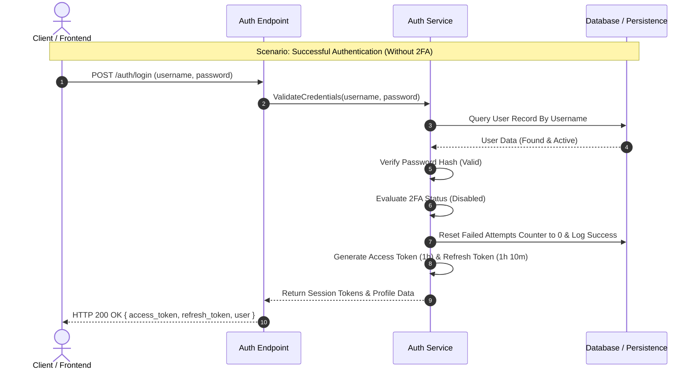
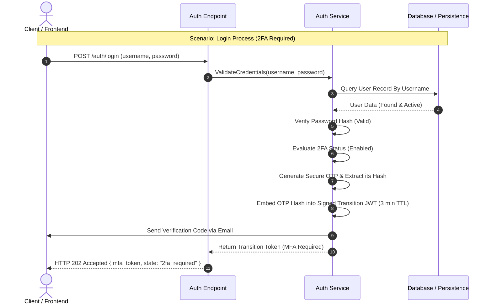
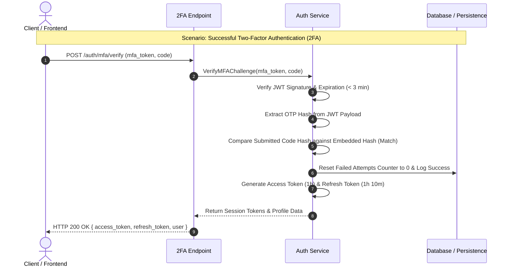

# Authentication Flow

**Last Updated:** July 18, 2026  
**Author:** Ismael Romero

---

# Introduction

Authentication represents the entry point to every protected resource within the Cakelet
platform. Because authentication is responsible for establishing the user's identity,
all subsequent authorization decisions depend on the correctness of this process.

The authentication subsystem has therefore been designed following a security-first
approach. Rather than limiting itself to credential verification, it incorporates
multiple validation stages intended to mitigate common attack vectors such as user
enumeration, brute-force attacks, credential stuffing, replay attempts, and unauthorized
access to suspended accounts.

The authentication workflow is divided into two independent phases. The first phase
validates the user's identity and determines whether an additional authentication factor
is required. The second phase, executed only when Two-Factor Authentication (2FA) is
enabled, validates possession of the temporary verification code before issuing the
definitive session tokens.

---

# Primary Authentication Flow

The authentication process begins when the client submits the user's credentials to the
authentication endpoint. Upon receiving the request, the Authentication Service retrieves
the corresponding user record from the persistence layer and performs a sequence of
security validations.

The first validation determines whether the supplied identifier exists in the system.
Whenever no matching account is found, the authentication process is immediately
terminated. A failed authentication event is recorded while a generic error response is
returned to the client. This behavior intentionally prevents user enumeration attacks by
avoiding any indication of whether a particular account exists.

If the account exists, the system verifies whether access is currently prohibited.
Two independent lock mechanisms are evaluated. The first determines whether the account
has been temporarily suspended due to repeated authentication failures, whereas the
second verifies whether the account has been administratively disabled.

Whenever either condition is satisfied, the authentication request is rejected,
the event is logged, and the client receives an account locked response.

Only after these preliminary validations have succeeded does the Authentication Service
proceed with password verification. The submitted password is processed using the
configured password hashing algorithm and compared against the stored password hash.
Authentication failures increment the user's failed-attempt counter. Once the configured
threshold is exceeded, the account is automatically transitioned to the locked state.

Following successful credential validation, the system determines whether the user has
enabled Two-Factor Authentication. If no second authentication factor is required,
the authentication process concludes by generating the definitive Access Token and
Refresh Token, retrieving the user's profile information, resetting the failed-attempt
counter, and returning an authenticated session to the client.

When 2FA is enabled, however, the authentication workflow is intentionally interrupted.
A cryptographically secure verification code is generated and delivered to the user's
registered email address. Simultaneously, a signed Temporary Transition Token (JWT) is
created with a maximum lifetime of three minutes. Rather than establishing a session,
the server returns this temporary token and requests completion of the second
authentication factor.

###  Successful Authentication (Without 2FA)

###  Initial Authentication (With 2FA Enabled)

---

# Two-Factor Authentication Flow

The second authentication phase begins after the user receives the verification code by
email. The client submits both the verification code and the Temporary Transition Token
to the dedicated 2FA endpoint.

The Authentication Service first validates the Temporary Transition Token by verifying
its signature and expiration time. Tokens exceeding the permitted lifetime are rejected
without further processing.

If the token remains valid, the submitted verification code is compared against the code
generated during the primary authentication phase.

Successful verification completes the authentication workflow. The failed-attempt counter
is reset, the user's profile is retrieved, definitive session tokens are generated, and
the authenticated session is returned to the client.

Conversely, unsuccessful verification results in a failed authentication event being
recorded and the failed-attempt counter being incremented. Once the configured threshold
is reached, the account becomes locked. The client receives an error describing whether
the verification code was invalid or whether the authentication session expired.

---

# Security Considerations

The authentication workflow incorporates several security mechanisms designed to reduce
the attack surface of the platform.

- Generic authentication responses prevent user enumeration.
- Failed authentication attempts are centrally logged.
- Automatic account locking mitigates brute-force attacks.
- Administrative locks immediately revoke access.
- Passwords are never compared in plaintext.
- Temporary Transition Tokens have a short lifetime and are cryptographically signed.
- Definitive session tokens are issued only after every authentication requirement has
  been successfully satisfied.

