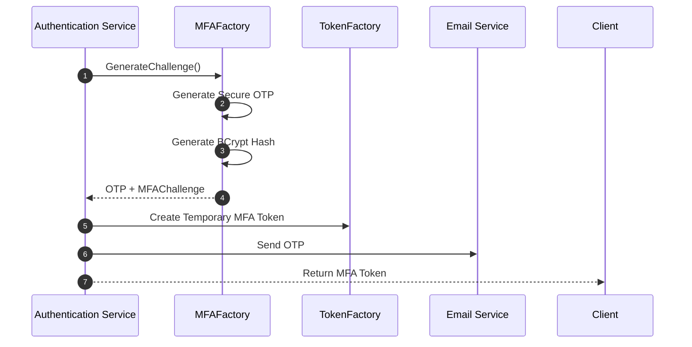
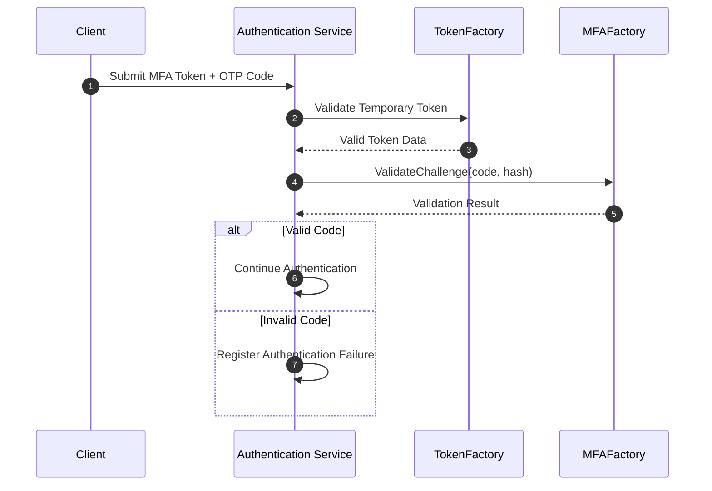

# MFAFactory Security Component Specification

**Last Updated:** July 18, 2026  
**Author:** Ismael Romero

---

# 1. Introduction & Responsibility

The `MFAFactory` is a security component responsible for generating and validating
Multi-Factor Authentication (MFA) verification challenges.

Its primary responsibility is to provide the cryptographic operations required to
protect one-time verification codes during an MFA authentication workflow.

The component is responsible for:

- Generating cryptographically secure OTP values.
- Protecting OTP values through secure hashing.
- Validating user-provided OTP values against protected representations.
- Providing expiration metadata associated with generated challenges.

The `MFAFactory` does not manage:

- User accounts.
- Authentication flows.
- Email delivery.
- Token generation.
- Token validation.
- Persistence operations.
- MFA enrollment.
- Session creation.

The component only handles the cryptographic lifecycle of MFA challenges.

The architectural boundary can be summarized as:

```text
Authentication Service
          |
          |
          v
      MFAFactory
          |
          |
          v
 Secure MFA Challenge Processing
```

The responsibility of the component ends once the challenge has been generated or
validated.

---

# 2. Design & Architecture

The `MFAFactory` follows the security subsystem architectural principles:

- Stateless operation.
- Cryptographic isolation.
- Dependency injection.
- Independent testability.
- Separation from authentication workflows.

The component does not persist generated challenges or maintain MFA state.

---

# 2.1 Interface-Based Abstraction

The component exposes the `MFAFactory` interface as its public contract.

Example:

```go
type MFAFactory interface {
    GenerateChallenge() (string, *MFAChallenge, error)

    ValidateChallenge(
        code string,
        challengeHash string,
    ) (bool, error)
}
```

Higher-level authentication services depend on the interface rather than the concrete
implementation.

This provides:

- Easier unit testing.
- Reduced coupling.
- Ability to replace the underlying MFA implementation.

---

# 2.2 Dependency Injection

The component integrates with Uber Fx through constructor-based dependency injection.

The constructor receives application configuration:

```go
func NewMFAFactory(cfg *config.Config) MFAFactory
```

The security module registers the component through:

```go
var Module = fx.Options(
    fx.Provide(
        factory.NewPasswordFactory,
        factory.NewTokenFactory,
        factory.NewMFAFactory,
    ),
)
```

The component receives only configuration required for:

- OTP length.
- Challenge expiration.
- Hashing parameters.

The `MFAFactory` does not receive:

- User repositories.
- Authentication services.
- Email services.
- Token services.

---

# 3. MFA Challenge Architecture

The MFA workflow uses temporary cryptographic challenges instead of persistent OTP
storage.

The plaintext OTP is only available during challenge generation.

The protected representation contains:

- OTP hash.
- Expiration metadata.

The general lifecycle:

```text
Generate Secure OTP
          |
          v
Generate OTP Hash
          |
          v
Return Plain OTP + Protected Challenge
          |
          v
Authentication Layer Protects Challenge Data
          |
          v
User Submits OTP
          |
          v
Validate OTP Against Hash
```

The `MFAFactory` does not know where the challenge representation is transported or
stored.

---

# 4. MFA Challenge Structure

The generated challenge is represented by:

```go
type MFAChallenge struct {
    CodeHash  string
    ExpiresAt time.Time
}
```

## CodeHash

Contains the BCrypt representation of the generated OTP.

Example:

```text
$2b$12$8s91...
```

The plaintext OTP is never stored.

---

## ExpiresAt

Defines the maximum validity period assigned to the generated challenge.

Expiration enforcement belongs to the component responsible for transporting the
challenge state, such as a temporary authentication token.

---

# 5. Public API

The `MFAFactory` exposes two operations:

- Challenge generation.
- Challenge validation.

---

# 5.1 GenerateChallenge

## Signature

```go
GenerateChallenge() (
    string,
    *MFAChallenge,
    error,
)
```

## Description

Generates a secure one-time verification challenge.

The operation performs:

1. Generate a cryptographically secure numeric OTP.
2. Generate a BCrypt hash representation.
3. Create the MFA challenge metadata.
4. Return the plaintext OTP for delivery and the protected challenge.

Example:

Generated OTP:

```text
482913
```

Protected representation:

```text
$2b$12$8s91...
```

The plaintext code must only be used by the authentication workflow responsible for
delivery.

---

# 5.2 ValidateChallenge

## Signature

```go
ValidateChallenge(
    code string,
    challengeHash string,
) (bool, error)
```

## Description

Validates whether a submitted MFA code matches the previously generated challenge
hash.

The operation performs:

1. Receives the submitted OTP.
2. Compares it against the BCrypt challenge hash.
3. Returns the validation result.

---

## Output

Valid OTP:

```text
true
```

Invalid OTP:

```text
false
```

Internal validation failures:

```text
error
```

---

# 6. Authentication Flow Integration

The `MFAFactory` is invoked after primary credential validation.

The authentication workflow remains responsible for:

- Determining whether MFA is required.
- Sending the OTP.
- Protecting challenge metadata.
- Creating authenticated sessions.

---

## 6.1 Challenge Generation Flow



---

## 6.2 Challenge Verification Flow



---

# 7. Security Requirements

## 7.1 OTP Protection

Verification codes must:

- Never be stored in plaintext.
- Never appear in logs.
- Never be returned by APIs.
- Be generated using cryptographically secure randomness.

---

## 7.2 Secure Random Generation

OTP generation uses cryptographic randomness.

The implementation must not use:

- Predictable random generators.
- Sequential values.
- Timestamp-based generation.

---

## 7.3 Hash Protection

OTP hashes must:

- Use a secure password hashing algorithm.
- Include automatic salt generation.
- Prevent recovery of the original OTP value.

---

## 7.4 Stateless Operation

The `MFAFactory`:

- Does not persist challenges.
- Does not store OTP values.
- Does not track verification attempts.
- Does not manage MFA sessions.

State management belongs to higher-level authentication components.

---

# 8. Error Handling

Errors generated by `MFAFactory` follow:

```text
security/factory:
```

| Error | Description |
|---|---|
| `ErrInvalidChallenge` | Returned when challenge validation cannot be processed. |
| `ErrCodeMismatch` | Returned when the provided code does not match. |
| `ErrChallengeGeneration` | Returned when secure OTP generation fails. |
| `ErrHashGeneration` | Returned when OTP hashing fails. |

---

# 9. Design Principles Summary

The `MFAFactory` follows these principles:

- **Single Responsibility:** Handles MFA cryptographic operations only.
- **Stateless Design:** Does not persist MFA state.
- **Cryptographic Isolation:** Encapsulates OTP generation and validation.
- **Secure Challenge Handling:** Protects OTP values using hashing.
- **Workflow Independence:** Does not manage authentication decisions.
- **Testability:** Provides an interface-based abstraction.